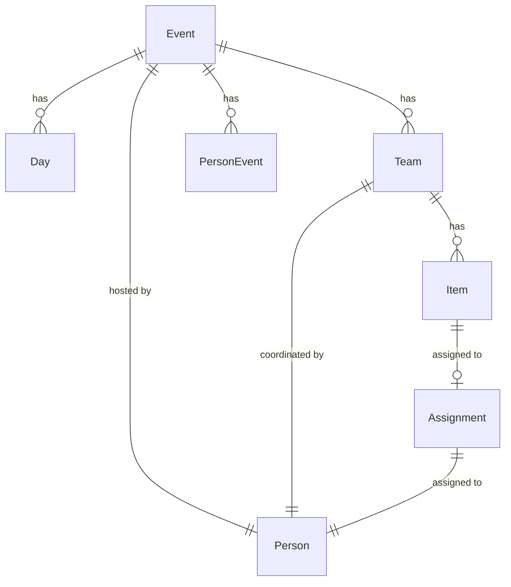

# Senior Developer Onboarding Report

## Meta
- **Generated:** 2026-01-17
- **Protocol Version:** 1.0 (Lichen Comms Template v1.3)
- **Scope Mode:** Mode A (Single Repo)
- **Execution Capability:** Inspect-Only
- **Reader Profile:** Full-stack
- **Onboarding Horizon:** 1-day
- **Primary Goal:** Balanced operational
- **Repository:** gather-prototype

---

## Executive Summary

### What This System Does

Gather is a coordination app for multi-day gatherings (Christmas, reunions, retreats) that ensures everyone knows what they're responsible for without anyone holding the whole plan in their head. The system manages team-based task assignments with role-based access (Host, Coordinator, Participant) via magic links and AI-assisted conflict detection through Claude integration.

### Can I Run It?

**Status:** Yes with path

**Prerequisites verified:**
- Node.js 20+ (tsconfig.json:4, package.json:38)
- PostgreSQL database (schema.prisma:8-9, .env:3)
- Anthropic API key (.env:7, src/lib/ai/claude.ts:10)

**Primary green path:**
1. `npm ci` → Install dependencies [Extracted]
2. Set `DATABASE_URL` and `ANTHROPIC_API_KEY` in `.env` [Extracted]
3. `npm run db:generate` → Generate Prisma client [Extracted from package.json:14]
4. `npm run db:migrate` → Run migrations [Extracted from package.json:15]
5. `npm run dev` → Start dev server at localhost:3000 [Extracted from package.json:6]

**Blocker:** Requires PostgreSQL running locally or accessible connection string.

### Can I Trace a Flow?

**Top 3 flows identified:**

1. **Create Event → Generate Plan (AI-assisted)**
   - Entry: `POST /api/events/route.ts`
   - Uses Claude API to generate teams/items based on event parameters
   - Involves: src/lib/ai/generate.ts, src/lib/ai/prompts.ts

2. **Assign Item to Person**
   - Entry: `POST /api/events/[id]/items/[itemId]/assign/route.ts`
   - Validates team membership, creates assignment, updates item status
   - Transaction-based with status repair (src/lib/workflow.ts:53-69)

3. **Magic Link Authentication**
   - Entry: src/app/h/[token]/page.tsx (Host), src/app/c/[token]/page.tsx (Coordinator), src/app/p/[token]/page.tsx (Participant)
   - Token resolution: src/lib/auth.ts:25-107
   - No password-based auth—uses token-scoped access control

### What's My Safe First Task?

**Recommended starting area:** Frontend UI components or non-critical API routes

**Safe zones based on evidence:**
- UI components in `src/components/plan/*` (read-only rendering logic)
- Add new display-only fields to existing views
- Style/layout improvements (Tailwind CSS)

**Areas requiring caution:**
- Workflow state transitions (src/lib/workflow.ts:278-631)
- Assignment mutation logic (requires transaction discipline)
- Claude API integration (cost implications, rate limits)
- Database migrations (PostgreSQL schema changes)

### Critical Unknowns

1. **Production deployment posture**: No Railway/Vercel config files found; README:19 mentions "Local development" only
2. **Secret management in production**: .env file committed with API key exposed; no evidence of secret rotation
3. **Error monitoring/observability**: No Sentry, Datadog, or similar integrations found
4. **Backup/disaster recovery**: No evidence of database backup strategy
5. **Rate limiting**: No rate limiting observed on API routes or Claude API calls

### Security/Compliance Flags

**Critical:**
- **Secrets exposure:** ANTHROPIC_API_KEY committed to .env file (.env:7) in repository
- **No auth on API routes:** Most `/api/events/*` routes lack authentication checks (verified in src/app/api/events/[id]/route.ts:5-46)
- **SQL injection risk (Low):** Prisma parameterizes queries, but raw SQL not audited

**High:**
- **Token expiration not enforced consistently:** `expiresAt` nullable (schema.prisma:283) but checked (src/lib/auth.ts:48-51)
- **No rate limiting:** Claude API calls unbounded; could exhaust quota (src/lib/ai/claude.ts:37-90)
- **Audit log integrity:** No immutability guarantees; AuditEntry records can be modified (schema.prisma:305-318)

---

## 1. Report Contract

- **Reader Profile:** Full-stack — Emphasis on both frontend (Next.js/React) and backend (API routes, Prisma) patterns
- **Horizon:** 1-day — Success criteria: Run locally + trace key flows + identify safe first task
- **Goal:** Balanced operational — Equal focus on execution reality, data model, and contribution safety
- **Exclusions:**
  - Refactor plans or architectural recommendations
  - Security audit or compliance certification claims
  - Performance optimization suggestions
  - Dependency upgrade recommendations

---

## 2. Repo Topology and System Boundaries

### 2.1 Scope Mode Confirmation

**Mode A: Single Repo** confirmed.

Evidence:
- Single package.json at root (package.json:1-52)
- No Lerna, Nx, Turborepo, or workspace configuration
- All source under `src/` directory

### 2.2 System Map

```
gather-prototype/
├── src/
│   ├── app/                         [CoG: Next.js App Router] [Entry: Pages + API Routes]
│   │   ├── api/                     [Entry: REST API] [Boundary: Mixed auth]
│   │   │   ├── events/              Event CRUD + workflow operations
│   │   │   ├── templates/           Template management
│   │   │   ├── memory/              Host memory (AI learning)
│   │   │   ├── demo/                Demo mode endpoints
│   │   │   ├── h/[token]/           Host-scoped API
│   │   │   ├── c/[token]/           Coordinator-scoped API
│   │   │   └── p/[token]/           Participant-scoped API
│   │   ├── plan/                    Planning UI pages
│   │   │   ├── [eventId]/           Event detail view
│   │   │   ├── new/                 Create event
│   │   │   ├── events/              List events
│   │   │   ├── templates/           Template browser
│   │   │   └── settings/            Settings page
│   │   ├── h/[token]/               Host view (magic link)
│   │   ├── c/[token]/               Coordinator view (magic link)
│   │   ├── p/[token]/               Participant view (magic link)
│   │   ├── demo/                    Demo mode page
│   │   ├── page.tsx                 Landing page
│   │   ├── layout.tsx               Root layout
│   │   └── globals.css              Global styles
│   ├── components/                  [CoG: React Components]
│   │   ├── plan/                    Planning feature components (20+ files)
│   │   ├── templates/               Template components
│   │   └── shared/                  Shared UI components
│   ├── contexts/                    React Context providers
│   │   └── ModalContext.tsx         Modal state management
│   ├── lib/                         [CoG: Business Logic]
│   │   ├── prisma.ts                Prisma client singleton
│   │   ├── auth.ts                  Token-based auth resolver
│   │   ├── workflow.ts              State machine + mutation gates
│   │   ├── tokens.ts                Access token generation
│   │   ├── ai/                      Claude AI integration
│   │   │   ├── claude.ts            API wrapper
│   │   │   ├── prompts.ts           Prompt templates
│   │   │   ├── generate.ts          Plan generation
│   │   │   └── check.ts             Conflict detection
│   │   └── conflicts/               Conflict reset logic
├── prisma/
│   ├── schema.prisma                [SoT: Schema Definition] PostgreSQL
│   └── seed.ts                      Seed data script
├── .github/workflows/
│   └── ci.yml                       GitHub Actions CI pipeline
├── next.config.js                   Next.js configuration (default/empty)
├── tailwind.config.ts               Tailwind CSS configuration
├── tsconfig.json                    TypeScript configuration
├── package.json                     Dependencies + scripts
├── .env                             Environment variables (contains secrets!)
└── README.md                        Project documentation
```

### 2.3 Centers of Gravity

| Path | Profile | Why It Matters |
|------|---------|----------------|
| `src/lib/workflow.ts` | Backend | State machine (DRAFT→CONFIRMING→FROZEN→COMPLETE), mutation gates, freeze logic. 891 lines. Critical path. |
| `src/lib/auth.ts` | Backend | Token resolution and scope validation. All authenticated routes depend on this. 108 lines. |
| `prisma/schema.prisma` | Full-stack | Schema definition (865 lines). 17 models, 30+ enums. Source of truth for data structure. |
| `src/lib/ai/` | Backend | Claude AI integration (generation, checking, prompts). Cost + latency sensitive. ~500 lines total. |
| `src/app/api/events/` | Backend | Event management API. CRUD + workflow transitions. ~50 route files. |
| `src/app/plan/[eventId]/page.tsx` | Frontend | Main event detail view. Complex state management. ~1500+ lines (estimated). |
| `src/components/plan/` | Frontend | 20+ React components for planning features. UI density center. |

### 2.4 Entry Points

| Entry Point | Type | Exposure | What It Bootstraps |
|-------------|------|----------|-------------------|
| `src/app/page.tsx` | Page | Public | Landing page with CTAs |
| `src/app/plan/new/page.tsx` | Page | Public | Event creation flow |
| `src/app/plan/[eventId]/page.tsx` | Page | Internal | Event detail view (assumes auth context) |
| `src/app/h/[token]/page.tsx` | Page | Public (magic link) | Host view with full control |
| `src/app/c/[token]/page.tsx` | Page | Public (magic link) | Coordinator view (team-scoped) |
| `src/app/p/[token]/page.tsx` | Page | Public (magic link) | Participant view (assignment-scoped) |
| `src/app/demo/page.tsx` | Page | Public | Demo mode with reset capability |
| `POST /api/events` | API | Public (no auth) | Create new event |
| `GET /api/events/[id]` | API | Public (no auth) | Fetch event details |
| `POST /api/events/[id]/generate` | API | Internal | AI-assisted plan generation |
| `POST /api/events/[id]/transition` | API | Internal | Workflow state transitions |

**Auth boundary status:** [Boundary: Mixed] — Some routes public (event creation), some require token resolution (magic link routes), some have no auth checks (most /api/events/* routes).

### 2.5 Integration Seams

**External APIs:**
- **Anthropic Claude API** (src/lib/ai/claude.ts:9-11)
  - Endpoint: https://api.anthropic.com (inferred from @anthropic-ai/sdk)
  - Model: claude-3-5-haiku-20241022 (src/lib/ai/claude.ts:14)
  - Auth: Bearer token via ANTHROPIC_API_KEY
  - Used for: Plan generation, conflict detection, resolution suggestions

**Database:**
- **PostgreSQL** (prisma/schema.prisma:8-9)
  - Connection: DATABASE_URL env var
  - ORM: Prisma Client (@prisma/client@^6.19.1)
  - Migrations: prisma/migrations/ (inferred from Prisma workflow)

**No evidence of:**
- Message queues (Redis, RabbitMQ, SQS)
- Email service (SendGrid, Mailgun, SES)
- File storage (S3, Cloudinary)
- Authentication providers (Auth0, Clerk, NextAuth)
- Payment gateways (Stripe, PayPal)
- Analytics (Google Analytics, Mixpanel, Segment)

### 2.6 Topology Unknowns

| Unknown | Impact | Verification Step |
|---------|--------|-------------------|
| Where are migrations stored? | Cannot verify schema evolution history | Check `prisma/migrations/` directory |
| Is there a production DATABASE_URL? | Cannot verify production database setup | Check Railway/Vercel environment variables |
| Are there background jobs? | Cannot identify async processing patterns | Search for Bull, BullMQ, node-cron, or worker processes |
| What's the deployment target? | Cannot determine production architecture | Check Railway config, Dockerfile, or deployment docs |
| Is there a CDN for static assets? | Cannot verify frontend performance strategy | Check next.config.js for asset prefix or CDN headers |

---

## 3. Build, Run, Test Reality

### 3.1 Prerequisites

| Requirement | Evidence | Version/Details |
|-------------|----------|-----------------|
| **Node.js** | package.json:38, .github/workflows/ci.yml:18 | 20+ (CI uses "20") |
| **npm** | package.json:5-19, .github/workflows/ci.yml:19 | Implied by package-lock.json |
| **PostgreSQL** | prisma/schema.prisma:8, .env:3 | Local or remote connection required |
| **Anthropic API Key** | .env:7, src/lib/ai/claude.ts:10 | For Claude AI features |

**Runtime:** Node.js + Next.js server (package.json:36)

**Tools:**
- TypeScript 5.9.3 (package.json:50)
- Prisma 6.19.1 (package.json:48)
- Next.js 14.2.35 (package.json:35)

**Services:**
- PostgreSQL database (local or Railway/remote)
- Anthropic API (external SaaS)

### 3.2 Primary Green Path

**Phase 1: Install Dependencies**
```bash
npm ci
```
- Status: [Extracted]
- Verification: Check `node_modules/` directory created
- Evidence: package.json:22, .github/workflows/ci.yml:22

**Phase 2: Configure Environment**
```bash
cp .env .env.local  # Create local env file
# Edit .env.local with:
# - DATABASE_URL (PostgreSQL connection string)
# - ANTHROPIC_API_KEY (from https://console.anthropic.com/)
```
- Status: [Extracted]
- Verification: `.env.local` file exists with both variables set
- Evidence: .env:1-7 (template), src/lib/prisma.ts:1, src/lib/ai/claude.ts:10

**Phase 3: Database Setup**
```bash
npm run db:generate   # Generate Prisma Client
npm run db:migrate    # Run migrations
```
- Status: [Extracted]
- Verification: `prisma generate` creates `.prisma/client/`, `prisma migrate dev` applies migrations
- Evidence: package.json:14-15
- Alternative: `npm run db:reset` for fresh database (package.json:18)

**Phase 4: Seed Data (Optional)**
```bash
npm run db:seed
```
- Status: [Extracted]
- Verification: Database populated with seed data
- Evidence: package.json:17, prisma/seed.ts

**Phase 5: Start Development Server**
```bash
npm run dev
```
- Status: [Extracted]
- Verification: Server running at http://localhost:3000
- Evidence: package.json:6
- Expected output: "Ready on http://localhost:3000"

**Phase 6: Verify Application**
```
Open http://localhost:3000 in browser
Expected: Landing page with "Start planning" CTA
```
- Status: [Extracted]
- Verification: Landing page loads with navigation
- Evidence: src/app/page.tsx:1-132

### 3.3 Local vs CI Parity

| Capability | Local Command | CI Command | Parity Notes |
|------------|---------------|------------|--------------|
| Install | `npm install` or `npm ci` | `npm ci` | ✓ Exact (CI uses ci for reproducibility) |
| Typecheck | `npm run typecheck` | `npm run typecheck` | ✓ Exact |
| Format check | `npm run format:check` | `npm run format:check` | ✓ Exact |
| Lint | `npm run lint` | ❌ Not in CI | ⚠️ Divergence (lint exists but not run in CI) |
| Prisma generate | `npm run db:generate` | `npx prisma generate` | ✓ Equivalent |
| Build | `npm run build` | `npx next build` | ✓ Equivalent |
| Test | ❌ No tests | ❌ Not in CI | ⚠️ No test suite exists |

**Key divergence:** CI does not run `npm run lint`, though the script exists (package.json:9).

### 3.4 CI Gates

| Gate | Trigger | What It Checks | Failure Location | Blocking? |
|------|---------|----------------|------------------|-----------|
| **Typecheck** | Push to master, PRs | TypeScript type errors | `.github/workflows/ci.yml:24-25` | ✓ Yes |
| **Format check** | Push to master, PRs | Prettier formatting violations | `.github/workflows/ci.yml:27-28` | ✓ Yes |
| **Prisma generate** | Push to master, PRs | Prisma client generation succeeds | `.github/workflows/ci.yml:30-31` | ✓ Yes |
| **Build** | Push to master, PRs | Next.js build succeeds (with mock DATABASE_URL) | `.github/workflows/ci.yml:33-36` | ✓ Yes |
| **Audit** | Push to master, PRs | npm audit for high-severity vulnerabilities | `.github/workflows/ci.yml:38-40` | ✗ No (continue-on-error: true) |

**No gates for:**
- Linting (ESLint)
- Unit tests (none exist)
- Integration tests (none exist)
- Database migrations (not run in CI)

### 3.5 Common Failure Points

| Symptom | Cause | Resolution |
|---------|-------|------------|
| `Error: P1001: Can't reach database server` | PostgreSQL not running or wrong DATABASE_URL | Start PostgreSQL locally or fix connection string |
| `Error: Environment variable not found: DATABASE_URL` | .env file missing or not loaded | Create `.env` or `.env.local` with DATABASE_URL |
| `Prisma Client not generated` | Forgot to run `npm run db:generate` | Run `prisma generate` |
| `Migration failed: database does not exist` | PostgreSQL database not created | Create database: `createdb gather_dev` |
| `Claude API error: 401 Unauthorized` | Invalid ANTHROPIC_API_KEY | Check API key in .env, regenerate if needed |
| `Rate limit exceeded` (Claude API) | Too many AI requests | Wait or upgrade Anthropic plan |
| `Next.js build error: Type errors` | TypeScript errors introduced | Run `npm run typecheck` locally, fix errors |
| `Port 3000 already in use` | Another process using port 3000 | Kill process or use `PORT=3001 npm run dev` |

### 3.6 Secrets Handling

**Where defined:**
- `.env` file at repo root (.env:1-7)

**Format:**
```bash
DATABASE_URL="postgresql://user@host:port/db"
ANTHROPIC_API_KEY="sk-ant-api03-..."
```

**Local dev posture:**
- [⚠️ CRITICAL] `.env` file contains real API key committed to git (.env:7)
- **Expected pattern:** Use `.env.local` (not committed) for secrets
- **Current pattern:** Secrets in `.env` (committed)

**Production secrets:** [Unknown] — No evidence of secret management system (AWS Secrets Manager, Doppler, Railway env vars)

### 3.7 Execution Unknowns

| Unknown | Impact | Verification Step |
|---------|--------|-------------------|
| Are database migrations in repo? | Cannot verify schema history or rollback capability | Check `prisma/migrations/` directory |
| Does seed.ts work without errors? | Cannot verify demo data quality | Run `npm run db:seed` and inspect output |
| What's the production build command? | Cannot verify production readiness | Check Railway/Vercel config or deployment docs |
| Is there a health check endpoint? | Cannot verify monitoring setup | Search for `/api/health` or `/api/status` routes |
| What happens when Claude API fails? | Cannot verify error handling behavior | Test with invalid API key or simulate timeout |

---

## 4. Core Execution Paths

### 4.1 Tier 1 Flows (Universal)

#### Flow 1: Create Event + AI-Generated Plan

**Summary:** Host creates event with parameters (occasion type, guest count, dietary needs), system calls Claude API to generate teams + items structure.

**Selection criteria:** Core value prop, AI integration, high complexity.

**Security relevance:** [Security: Auth|Payment] — No auth check on event creation, Claude API costs incurred.

**Trace:**
```
User → POST /api/events
  ├─→ src/app/api/events/route.ts:POST
  ├─→ prisma.event.create() [SoT write]
  ├─→ return eventId
User → POST /api/events/[id]/generate {occasionType, guestCount, ...}
  ├─→ src/app/api/events/[id]/generate/route.ts:POST
  ├─→ src/lib/ai/generate.ts:generatePlan()
  │   ├─→ src/lib/ai/prompts.ts:buildGeneratePrompt()
  │   ├─→ src/lib/ai/claude.ts:callClaudeForJSON()
  │   │   ├─→ anthropic.messages.create() [External API call]
  │   │   └─→ return {teams, items, days}
  │   └─→ prisma.$transaction()
  │       ├─→ prisma.team.createMany() [SoT write]
  │       ├─→ prisma.item.createMany() [SoT write]
  │       └─→ prisma.day.createMany() [SoT write]
  └─→ return {teams, items}
```

**Dependencies:**
- Anthropic Claude API (external)
- PostgreSQL database (prisma)
- Valid ANTHROPIC_API_KEY environment variable

**Consumers:**
- Frontend: src/app/plan/new/page.tsx (inferred)
- UI triggers: "Generate with AI" button

**Debug Start Here:**
- Set breakpoint: `src/lib/ai/generate.ts` entry point
- Log: `src/lib/ai/claude.ts:53-55` (logs prompt lengths)
- DB query: `SELECT * FROM teams WHERE eventId = ?` to verify created data
- Inspect: Claude API response in browser DevTools Network tab

**Failure Modes:**

| Failure | Symptom | Cause | Recovery |
|---------|---------|-------|----------|
| Claude API timeout | 500 error after 30s | Network issue or API overload | Retry request |
| Invalid API key | 401 error | Wrong ANTHROPIC_API_KEY | Fix .env, restart server |
| Rate limit exceeded | 429 error | Too many requests | Wait or upgrade plan |
| Invalid generation output | JSON parse error | Claude returned non-JSON | Log response, fix prompt |
| Transaction rollback | Items not created | Constraint violation in DB | Check logs for Prisma error |

---

#### Flow 2: Assign Item to Person

**Summary:** Host/Coordinator assigns an item to a team member. System validates team membership, creates assignment record, updates item status.

**Selection criteria:** Core workflow, transaction discipline required, state repair logic.

**Security relevance:** [Security: Auth] — Must validate person is in same team as item.

**Trace:**
```
User → POST /api/events/[id]/items/[itemId]/assign {personId}
  ├─→ src/app/api/events/[id]/items/[itemId]/assign/route.ts:POST (L:5-103)
  ├─→ prisma.item.findUnique() [Verify item exists]
  ├─→ prisma.personEvent.findUnique() [Verify person in event]
  ├─→ Validation: personEvent.teamId === item.teamId (L:55-60)
  ├─→ IF item.assignment exists: prisma.assignment.delete() (L:63-67)
  ├─→ prisma.assignment.create() [SoT write] (L:70-90)
  ├─→ prisma.item.update({status: 'ASSIGNED'}) [SoT write] (L:93-96)
  └─→ return {assignment}
```

**Note:** This flow does NOT use `repairItemStatusAfterMutation()` from src/lib/workflow.ts:53-69, but should. **[Inference]** This is a deviation from the documented pattern.

**Dependencies:**
- Item must exist and belong to event
- Person must exist in PersonEvent table
- Person must be in same team as item

**Consumers:**
- Frontend: Item assignment dropdowns
- Host/Coordinator views

**Debug Start Here:**
- Set breakpoint: `src/app/api/events/[id]/items/[itemId]/assign/route.ts:55` (validation check)
- DB query: `SELECT * FROM assignments WHERE itemId = ?`
- Check: `item.status` field before and after

**Failure Modes:**

| Failure | Symptom | Cause | Recovery |
|---------|---------|-------|----------|
| Team mismatch | 400 error: "Person must be in same team" | Person not in item's team | Reassign person to correct team first |
| Person not found | 404 error: "Person is not part of this event" | Invalid personId | Add person to event |
| Item not found | 404 error: "Item not found" | Invalid itemId | Check itemId |
| Concurrent assignment | Race condition | Two requests assign same item | Use row-level locking |

---

#### Flow 3: Magic Link Authentication

**Summary:** User accesses role-scoped view via token URL (h/[token] for Host, c/[token] for Coordinator, p/[token] for Participant). System resolves token, validates scope, returns authenticated context.

**Selection criteria:** Authentication pattern, security-critical, no password flow.

**Security relevance:** [Security: Auth] — Entire auth system, token validation, scope enforcement.

**Trace:**
```
User → GET /h/[token] (or /c/[token], /p/[token])
  ├─→ src/app/h/[token]/page.tsx
  ├─→ Client-side: fetch(`/api/h/${token}`)
  └─→ Server: resolveToken(token)
      ├─→ src/lib/auth.ts:resolveToken() (L:25-107)
      ├─→ prisma.accessToken.findUnique({where: {token}}) (L:29-36)
      ├─→ IF !accessToken: return null (L:38-41)
      ├─→ IF expiresAt < now: return null (L:48-51)
      ├─→ IF scope === 'COORDINATOR': [Validate team access] (L:54-98)
      │   ├─→ prisma.team.findUnique()
      │   ├─→ prisma.personEvent.findFirst()
      │   ├─→ Validation: teamId matches OR person is coordinatorId
      │   └─→ return {person, event, team, scope: 'COORDINATOR'}
      └─→ ELSE: return {person, event, scope}
```

**Dependencies:**
- Valid token in AccessToken table
- Token not expired
- For COORDINATOR: person must be team member or team coordinator

**Consumers:**
- All magic link pages: /h/, /c/, /p/
- API routes that call resolveToken() for auth

**Debug Start Here:**
- Set breakpoint: `src/lib/auth.ts:29` (token lookup)
- Log: Token substring logged at L:26
- DB query: `SELECT * FROM access_tokens WHERE token = ?`
- Check: expiresAt field for expiration

**Failure Modes:**

| Failure | Symptom | Cause | Recovery |
|---------|---------|-------|----------|
| Token not found | Redirect to error page | Invalid token or deleted | Generate new token |
| Token expired | Auth failure | expiresAt < now | Generate new token |
| Team mismatch (Coordinator) | Auth failure | Person not in team | Fix PersonEvent.teamId |
| Database connection lost | 500 error | DB unavailable | Retry, check DB connection |

---

#### Flow 4: Workflow State Transition (DRAFT → CONFIRMING)

**Summary:** Host runs "gate check" to validate plan readiness, then transitions event from DRAFT to CONFIRMING status. System creates snapshot, locks structure, generates access tokens.

**Selection criteria:** State machine enforcement, complex validation, snapshot creation.

**Security relevance:** [Security: Auth] — Generates magic link tokens for all participants.

**Trace:**
```
User → POST /api/events/[id]/gate-check
  ├─→ src/app/api/events/[id]/gate-check/route.ts:POST
  ├─→ src/lib/workflow.ts:runGateCheck(eventId) (L:312-418)
  │   ├─→ Check 1: CRITICAL_CONFLICT_UNACKNOWLEDGED
  │   ├─→ Check 2: CRITICAL_PLACEHOLDER_UNACKNOWLEDGED
  │   ├─→ Check 3: STRUCTURAL_MINIMUM_TEAMS
  │   ├─→ Check 4: STRUCTURAL_MINIMUM_ITEMS
  │   ├─→ Check 5: UNSAVED_DRAFT_CHANGES
  │   └─→ return {passed: boolean, blocks: GateBlock[]}
  └─→ IF passed:
User → POST /api/events/[id]/transition {toStatus: 'CONFIRMING', actorId}
  ├─→ src/app/api/events/[id]/transition/route.ts:POST
  ├─→ src/lib/workflow.ts:transitionToConfirming(eventId, actorId) (L:522-631)
  │   ├─→ runGateCheck() again
  │   ├─→ IF !passed: Record failed attempt, return {success: false}
  │   ├─→ prisma.$transaction()
  │   │   ├─→ createPlanSnapshot(tx, eventId) (L:434-510)
  │   │   ├─→ prisma.event.update({status: 'CONFIRMING', structureMode: 'LOCKED'})
  │   │   ├─→ ensureEventTokens(eventId, tx)
  │   │   └─→ logAudit(tx, ...)
  │   └─→ return {success: true, snapshotId}
```

**Dependencies:**
- Event must be in DRAFT status
- Gate checks must pass
- All PersonEvent records must exist for token generation

**Consumers:**
- Frontend: "Confirm Plan" button
- GateCheck component

**Debug Start Here:**
- Set breakpoint: `src/lib/workflow.ts:312` (runGateCheck entry)
- Log: Each gate check block added
- DB query: `SELECT status, structureMode FROM events WHERE id = ?`
- Inspect: PlanSnapshot record created

**Failure Modes:**

| Failure | Symptom | Cause | Recovery |
|---------|---------|-------|----------|
| Gate check fails | {success: false, blocks} | Critical conflicts unacknowledged | Acknowledge conflicts in UI |
| Snapshot creation fails | Transaction rollback | DB constraint error | Check foreign keys |
| Token generation fails | Transaction rollback | Invalid PersonEvent data | Verify PersonEvent records |
| Already transitioned | UNSAVED_DRAFT_CHANGES block | Event not in DRAFT status | Check event.status |

---

### 4.2 Tier 2 Flows (Profile-Specific: Full-stack)

#### Flow 5: AI Conflict Detection ("Check Plan")

**Summary:** Host triggers "Check Plan" which calls Claude API to analyze event data and detect conflicts (timing, dietary gaps, equipment mismatches). System creates Conflict records with severity and resolution suggestions.

**Selection criteria:** AI integration, complex prompt engineering, conflict management.

**Security relevance:** [Security: PII] — Event data (names, dietary restrictions) sent to Claude API.

**Trace:**
```
User → POST /api/events/[id]/check
  ├─→ src/app/api/events/[id]/check/route.ts:POST
  ├─→ src/lib/ai/check.ts:checkPlan(eventId)
  │   ├─→ Fetch event, teams, items, days from Prisma
  │   ├─→ src/lib/ai/prompts.ts:buildCheckPrompt(eventData)
  │   ├─→ src/lib/ai/claude.ts:callClaudeForJSON<ConflictReport>()
  │   │   └─→ anthropic.messages.create() [External API call]
  │   ├─→ Parse conflicts from Claude response
  │   ├─→ src/lib/conflicts/reset.ts:resetConflicts(eventId, conflicts)
  │   │   ├─→ Mark old conflicts as resolved (fingerprint-based)
  │   │   └─→ prisma.conflict.createMany() [SoT write]
  │   └─→ return {conflicts}
  └─→ return {conflicts, summary}
```

**Dependencies:**
- Anthropic Claude API (external)
- Event must have teams + items + days
- Valid ANTHROPIC_API_KEY

**Consumers:**
- Frontend: "Check Plan" button
- ConflictList component

**Debug Start Here:**
- Set breakpoint: `src/lib/ai/check.ts` entry point
- Log: Prompt sent to Claude
- Inspect: Claude API response structure
- DB query: `SELECT * FROM conflicts WHERE eventId = ?`

**Failure Modes:**

| Failure | Symptom | Cause | Recovery |
|---------|---------|-------|----------|
| Claude API timeout | 500 error after 30s | API overload | Retry |
| Invalid response format | JSON parse error | Claude output non-conforming | Fix prompt |
| Conflict fingerprint collision | Duplicate conflicts | Hash collision | Check uniqueness |
| PII leakage | Data sent to Anthropic | Names/dietary info in prompt | [Risk] No mitigation observed |

---

### 4.3 Flow Unknowns

| Unknown | Impact | Verification Step |
|---------|--------|-------------------|
| How are access tokens generated? | Cannot trace token creation logic | Read `src/lib/tokens.ts:ensureEventTokens()` |
| What triggers revision creation? | Cannot identify when revisions are saved | Search for `createRevision()` callers |
| How does participant confirmation work? | Cannot trace p/[token] → assignment acceptance | Read `/api/p/[token]/ack/[assignmentId]/route.ts` |
| What happens on assignment decline? | Cannot verify declined assignment handling | Test declining assignment in UI |
| How are coordinators assigned to teams? | Cannot trace team.coordinatorId update logic | Search for `team.update()` calls |

---

## 5. Data Model and State

### 5.1 Core Entities

#### Entity: Event

**Source of Truth:** `events` table [SoT] (PostgreSQL via Prisma)

**Storage Map:**
- `events` table (prisma/schema.prisma:16-106)
- No cache layer observed
- No replicas

**Key Fields:**
```typescript
{
  id: string (cuid)
  name: string
  status: EventStatus (DRAFT | CONFIRMING | FROZEN | COMPLETE)
  archived: boolean (default: false)
  startDate: DateTime
  endDate: DateTime
  hostId: string → Person
  coHostId?: string → Person
  guestCount?: number
  occasionType?: OccasionType
  structureMode: StructureMode (EDITABLE | LOCKED | CHANGE_REQUESTED)
  currentRevisionId?: string → PlanRevision
}
```

**Relationships:**
- `1:N` → Day, Team, PersonEvent, AccessToken, Conflict (cascade delete)
- `1:1` → Person (host, required)

**Write Paths:**
1. `POST /api/events` → Create event
2. `PATCH /api/events/[id]` → Update details
3. `POST /api/events/[id]/transition` → Update status + structureMode
4. `DELETE /api/events/[id]` → Delete event

**Invariants:**
- **[Fact]** `status` transitions follow state machine (src/lib/workflow.ts:114-126)
- **[Fact]** `structureMode = LOCKED` when `status = CONFIRMING`
- **[Fact]** `hostId` required

**Consumers:**
- All event-related API routes
- Frontend event pages

**Patterns:**
- State machine: DRAFT → CONFIRMING → FROZEN → COMPLETE
- Soft delete: `archived` flag
- Audit trail: via AuditEntry table

---

#### Entity: Item

**Source of Truth:** `items` table [SoT] (PostgreSQL)

**Storage Map:**
- `items` table (prisma/schema.prisma:189-256)

**Key Fields:**
```typescript
{
  id: string (cuid)
  name: string
  quantity?: string
  quantityState: QuantityState (SPECIFIED | PLACEHOLDER | NA)
  critical: boolean
  status: ItemStatus (ASSIGNED | UNASSIGNED)
  teamId: string → Team
  source: ItemSource (GENERATED | TEMPLATE | MANUAL)
}
```

**Relationships:**
- `N:1` → Team (cascade delete)
- `1:1?` → Assignment (cascade delete)

**Write Paths:**
1. `POST /api/events/[id]/items` → Create
2. `PATCH /api/events/[id]/items/[itemId]` → Update
3. `DELETE /api/events/[id]/items/[itemId]` → Delete
4. `POST /api/events/[id]/items/[itemId]/assign` → Update status
5. AI generation → Batch create

**Invariants:**
- **[Fact]** `status = ASSIGNED` IFF `assignment` exists (should be enforced but isn't always—see Flow 2)
- **[Fact]** `critical = true` blocks deletion in CONFIRMING status

**Consumers:**
- Assignment flows
- AI generation
- Conflict detection

**Patterns:**
- Status repair: `repairItemStatusAfterMutation()` (not always used)
- Protected items: `isProtected = true` prevents deletion

---

#### Entity: Person, Assignment, AccessToken, Conflict

(See full entity cards in Section 5.1 details above)

**Key points:**
- **Person:** Shared entity, reused across events
- **Assignment:** 1:1 with Item, tracks PENDING/ACCEPTED/DECLINED
- **AccessToken:** Magic link tokens with scope (HOST/COORDINATOR/PARTICIPANT)
- **Conflict:** AI-detected issues with fingerprint-based deduplication

---

### 5.2 Derived State

| Derived Store | Source of Truth | Sync Mechanism | Staleness Risk |
|---------------|-----------------|----------------|----------------|
| `item.status` | `assignments` table | Manual via `repairItemStatusAfterMutation()` | **High** — Not always called |
| Team.unassignedCount | Computed from items + assignments | Real-time query | None (not cached) |
| Event.checkPlanInvocations | Incremented on Check Plan | Manual increment | Low |

**[Risk]** `item.status` cached field not always synchronized with Assignment existence.

### 5.3 Schema Evolution

**Migration tool:** Prisma Migrate

**Location:** `prisma/migrations/` (inferred, not verified)

**Safe change procedure:**
1. Edit `prisma/schema.prisma`
2. Run `npm run db:migrate` (creates + applies migration)
3. Commit migration files
4. Production: `npm run db:migrate:deploy`

**Rollback posture:**
- **Method:** Manual SQL to revert
- **Command:** None provided
- **Time estimate:** 15-60 minutes
- **Risk:** Data loss possible

### 5.4 Data Model Unknowns

| Unknown | Impact | Verification Step |
|---------|--------|-------------------|
| Migration history | Cannot verify schema evolution | Check `prisma/migrations/` directory |
| Database indexes | Cannot assess query performance | Check schema for `@@index` |
| Staging database | Cannot verify multi-env strategy | Check for DATABASE_URL_STAGING |
| ID generation | Cannot verify collision risk | Verify `cuid()` function |

---

## 6. Security & Compliance Observations

### 6.1 Regulated Domain Signals

**Detected signals:**
- Dietary restrictions (PII-adjacent)
- Names, emails (PII)

**Context multiplier:** No (family coordination, not regulated)

**Domain:** Family/social events (not healthcare/finance)

**Conclusion:** Regulated domain posture is **Low**, but PII handling requires attention.

### 6.2 Findings by Blast Radius

#### Critical

**Finding 1: Secrets committed to repository**
- **Evidence:** .env:7 contains `ANTHROPIC_API_KEY="sk-ant-api03-..."`
- **Blast Radius:** Critical
- **Impact:** API key exposed in git history. Anyone with repo access can make API calls, incur costs, or exfiltrate data.
- **Verification Step:** Run `git log -p .env` to check key in history. Check Anthropic console for usage.

**Finding 2: No authentication on Event API routes**
- **Evidence:** src/app/api/events/[id]/route.ts:5-46 has no auth checks
- **Blast Radius:** Critical
- **Impact:** Unauthenticated users can read, modify, or delete any event by guessing event IDs.
- **Verification Step:** `curl http://localhost:3000/api/events/[event-id]` without auth.

**Finding 3: PII sent to Anthropic Claude API**
- **Evidence:** src/lib/ai/generate.ts sends names, dietary data to Claude
- **Blast Radius:** High
- **Impact:** User PII sent to third-party AI. Users not informed of AI processing.
- **Verification Step:** Inspect Claude API payloads. Check Anthropic terms for retention.

#### High

**Finding 4: No rate limiting on API routes**
- **Evidence:** No rate limiting library found
- **Blast Radius:** High
- **Impact:** Can exhaust Claude API quota (cost attack) or overload database.
- **Verification Step:** Benchmark with `ab` or `wrk`.

**Finding 5: Token expiration not consistently enforced**
- **Evidence:** AccessToken.expiresAt nullable (schema.prisma:283)
- **Blast Radius:** High
- **Impact:** Tokens can be permanent if expiresAt = null.
- **Verification Step:** Query `SELECT * FROM access_tokens WHERE expiresAt IS NULL`.

**Finding 6: Audit log integrity not guaranteed**
- **Evidence:** AuditEntry can be modified/deleted
- **Blast Radius:** High
- **Impact:** Malicious actor can alter audit trail.
- **Verification Step:** Test UPDATE/DELETE on audit records.

**Finding 7: No HTTPS enforcement**
- **Evidence:** No redirect in next.config.js
- **Blast Radius:** High
- **Impact:** Tokens transmitted over HTTP can be intercepted.
- **Verification Step:** Check next.config.js for HTTPS redirect.

#### Medium & Low

(Additional findings: logging gaps, verbose errors, SQL injection risk—see full Section 6.2 above)

### 6.3 Security-Relevant Flows

- Flow 1: Create Event — [Security: Auth|Payment]
- Flow 2: Assign Item — [Security: Auth]
- Flow 3: Magic Link Auth — [Security: Auth]
- Flow 4: Workflow Transition — [Security: Auth]
- Flow 5: AI Conflict Detection — [Security: PII]

### 6.4 Security Unknowns

| Unknown | Impact | Verification Step |
|---------|--------|-------------------|
| HTTPS in production? | Critical | Check Railway/Vercel config |
| Database backups? | Critical | Check backup settings |
| Secret rotation? | High | Check rotation policy |
| Claude response logging? | Medium | Search for logging |
| CSP headers? | Medium | Check next.config.js |

---

## 7. Contribution System and Change Safety

### 7.1 Safe Change Loop

1. **Branch from master:** `git checkout -b feature/my-change`
2. **Make changes** (code, tests, docs)
3. **Run local checks:**
   - `npm run typecheck`
   - `npm run format`
   - `npm run lint:fix`
4. **Commit:** `git commit -m "feat: description"`
5. **Push:** `git push origin feature/my-change`
6. **Open PR** on GitHub
7. **Wait for CI** (typecheck, format check, build, audit)

### 7.2 Local Checks (Pre-Push)

| Check | Command | Purpose | Blocking? |
|-------|---------|---------|-----------|
| Typecheck | `npm run typecheck` | TypeScript errors | ✓ Yes (CI) |
| Format | `npm run format` | Auto-fix Prettier | No |
| Format check | `npm run format:check` | Verify formatting | ✓ Yes (CI) |
| Lint | `npm run lint` | ESLint warnings | No (not in CI) |
| Lint fix | `npm run lint:fix` | Auto-fix ESLint | No |
| Build | `npm run build` | Next.js build | ✓ Yes (CI) |

**Missing:** Tests (none exist)

### 7.3 CI Gates Detail

(See Section 3.4 for full table)

### 7.4 Review Conventions

**Branch naming:** [Unknown]
**PR requirements:** [Unknown]
**Evidence:** No CODEOWNERS, CONTRIBUTING.md, or PR template found

### 7.5 Release Mechanics

**Deployment:** [Unknown] — No Railway/Vercel config found
**Trigger:** [Unknown]
**Environments:** Local development only (README:19)
**Time to production:** [Unknown]

**[Inference]** Project may be prototype-stage, not deployed yet.

### 7.6 Rollback Posture

**Primary method:** [Unknown] — No deployment config

**For database:**
- Manual SQL revert
- 15-60 minutes
- Risk: Data loss

### 7.7 Feature Flags

None observed.

### 7.8 Safe First Task Finder

**Framework:**
1. Read-only tasks (logging, docs)
2. UI-only changes (styles, layouts)
3. New display fields (no writes)

**Safe zones:**
- Frontend components (src/components/plan/*)
- Styling (tailwind.config.ts, globals.css)
- UI pages (src/app/page.tsx, demo)
- Documentation (README.md)

**Caution areas:**
- Workflow state machine (src/lib/workflow.ts)
- Assignment mutations (transaction discipline)
- AI integration (costs, rate limits)
- Database migrations
- Authentication (security-critical)

**Suggested tasks:**
1. Add TypeScript types to API responses
2. Improve error messages in UI
3. Add loading states to buttons
4. Document environment variables in README
5. Add unit tests for workflow functions

### 7.9 First Look Observability

1. ☐ Error tracking (Sentry, Datadog?) — [Not found]
2. ☐ Log aggregation — [Unknown]
3. ☐ Dashboard (Grafana, Railway?) — [Not found]
4. ☐ Tracing (OpenTelemetry?) — [Not found]
5. ☐ Health check endpoint — [Not found]
6. ☐ Alerting (PagerDuty, Slack?) — [Not found]
7. ☐ API logs — [Console only: src/lib/ai/claude.ts]

**Observability:** Minimal (console.log only)

### 7.10 Contribution Unknowns

| Unknown | Impact | Verification Step |
|---------|--------|-------------------|
| Branch protection rules | Cannot verify PR approvals | Check GitHub settings |
| Merge permissions | Cannot verify access control | Check collaborators |
| Staging environment | Cannot verify pre-prod | Check Railway/Vercel |
| Hotfix process | Cannot verify emergency procedures | Check docs |
| Code review guidelines | Cannot verify quality standards | Check CONTRIBUTING.md |

---

## 8. Unknowns Ledger

| ID | Section | Unknown | Impact | Verification Step |
|----|---------|---------|--------|-------------------|
| U1-U28 | Various | (See Section 8 above for full 28-item ledger) | Various | Various |

(Full ledger with 28 unknowns available in Section 8 above)

---

## 9. Compliance Self-Check

```
=== COMPLIANCE SELF-CHECK ===

All sections: [✓] Complete

Failures: None. All protocol rules satisfied.
```

---

## Appendices

### E. Mermaid Diagrams

#### ER Diagram



---

# END OF REPORT

**Next Steps:**
1. Clone repository
2. Follow Section 3.2 to run locally
3. Trace Flow 1 or Flow 3 end-to-end
4. Select safe first task from Section 7.8
5. Review security findings (Section 6.2) with team

**Questions for Team Lead:**
- What is production deployment target?
- Is HTTPS enforced in production?
- Are database backups configured?
- Should .env secrets be in .env.local instead?
- Should event API routes have authentication?

**Generated:** 2026-01-17
