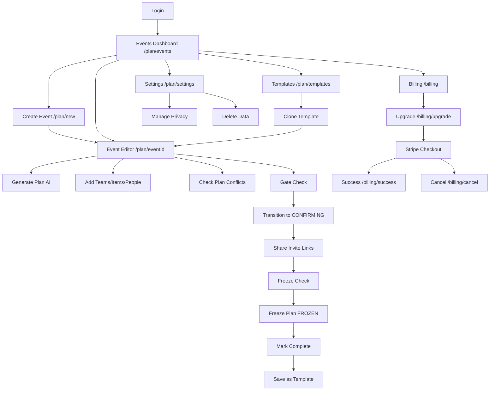
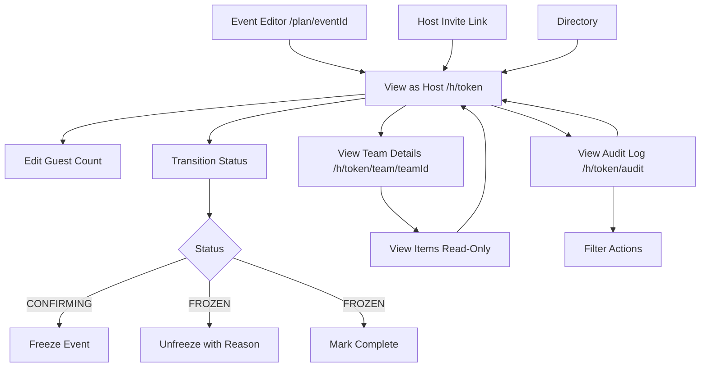
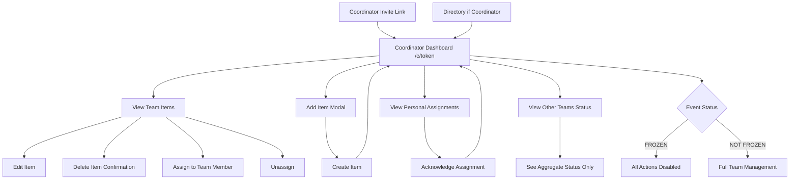
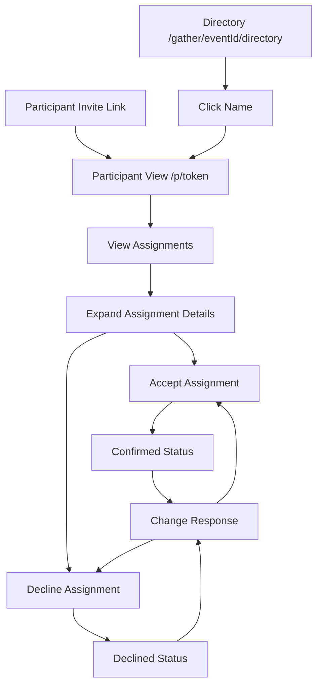

# UI MAP: Gather Prototype - Event Planning Application

**Generated:** 2026-01-19
**Codebase Version:** feature/shareable-directory branch

---

## Executive Summary

### Overview
Gather is a collaborative event planning application built with Next.js 14 (App Router), using magic link authentication and token-based access control for role-scoped views.

### Key Statistics
- **Roles identified:** 5 distinct roles (FREE, TRIALING, ACTIVE, PAST_DUE, CANCELED billing roles + HOST, COORDINATOR, PARTICIPANT event roles)
- **Total unique screens:** 28 pages
- **API endpoints:** 74+ routes
- **Event workflow states:** 4 (DRAFT → CONFIRMING → FROZEN → COMPLETE)

### Key Findings

#### Strengths
✅ Well-structured role-based access control with clear separation
✅ Comprehensive token-based authentication for shareable links
✅ Robust event lifecycle workflow with gate checks
✅ Real-time status updates via polling for host/coordinator views
✅ Detailed audit logging for all actions

#### Critical Issues
🚨 **CRITICAL:** Mock host IDs hardcoded in production code (`cmjwbjrpw0000n99xs11r44qh`)
⚠️ **HIGH:** Asymmetric frozen state handling between roles creates UX confusion
⚠️ **HIGH:** Permission validation gaps in coordinator routes
⚠️ **MEDIUM:** Navigation dead ends in settings/templates section
⚠️ **MEDIUM:** Missing error states for token expiration and access denial

---

## 1. User Roles and Access Levels

### 1.1 Billing-Based Roles (Global User Level)

#### FREE
- **Access:** 1 event per rolling 12 months
- **Limitations:** Cannot use AI features, limited to DRAFT stage only
- **UI:** Shows upgrade prompts when event limit reached

#### TRIALING
- **Access:** Unlimited events during trial period (30 days)
- **Limitations:** None during trial
- **UI:** Shows countdown of remaining trial days

#### ACTIVE
- **Access:** Unlimited events with full feature set
- **Limitations:** None
- **UI:** Full access to all planning tools

#### PAST_DUE
- **Access:** Can edit existing events (7-day grace), cannot create new
- **Limitations:** Creation blocked, reminders to update payment
- **UI:** Warnings in billing page, create event blocked

#### CANCELED
- **Access:** Read-only access to existing events
- **Limitations:** Cannot create or edit events
- **UI:** Resubscribe prompts in billing section

### 1.2 Event-Scoped Roles (Token-Based Access)

#### HOST
- **Scope:** Event-wide management
- **Access:**
  - All teams and items (read/write)
  - Event status transitions
  - Guest count management
  - Audit log access
  - Freeze/unfreeze controls
- **Entry Point:** `/h/[token]`
- **Token Scope:** `HOST`

#### COORDINATOR
- **Scope:** Team-specific management
- **Access:**
  - Own team items (create/edit/delete)
  - Team member assignments
  - Personal assignments across event
  - Other teams status (read-only)
- **Limitations:** Cannot freeze event, cannot manage other teams
- **Entry Point:** `/c/[token]`
- **Token Scope:** `COORDINATOR`

#### PARTICIPANT
- **Scope:** Personal assignments only
- **Access:**
  - View own assignments
  - Accept/decline items
  - See drop-off details
- **Limitations:** Read-only for event details, cannot modify anything
- **Entry Point:** `/p/[token]` or `/gather/[eventId]/directory`
- **Token Scope:** `PARTICIPANT`

---

## 2. Complete Screen Inventory by Role

### 2.1 AUTHENTICATED USER (Session-Based)

#### Screen: Events Dashboard
- **Route:** `/plan/events`
- **Purpose:** Central hub for all user events
- **Entry Points:** Navigation menu, post-login redirect, home page redirect
- **Components Visible:**
  - Page header with "Your Events" title
  - "Create New Event" button
  - "Show Archived" toggle
  - Event cards displaying:
    - Event name (clickable)
    - Status badge (DRAFT/CONFIRMING/FROZEN/COMPLETE)
    - Date range
    - Guest count
    - Team count
    - Occasion type
    - Archive/Restore/Delete buttons
- **Actions Available:**
  1. Create new event → `/plan/new`
  2. View event details → `/plan/{eventId}`
  3. Archive active event
  4. Restore archived event
  5. Delete archived event (with double confirmation)
  6. Toggle archived view
- **Data Displayed:** All events belonging to user (active and archived)
- **Limitations:** None

#### Screen: Create Event
- **Route:** `/plan/new`
- **Purpose:** Multi-step form to create new events
- **Entry Points:** Navigation menu, Events Dashboard "Create" button
- **Components Visible:**
  - **Step 1: Event Basics**
    - Event name input
    - Occasion type dropdown
    - Description textarea
    - Start/end date pickers
    - Progress indicator (1/3)
  - **Step 2: Guests & Dietary**
    - Guest count input
    - Guest confidence level
    - Min/max guests
    - Dietary requirements (vegetarian, vegan, GF, DF counts)
    - Other dietary notes textarea
    - Progress indicator (2/3)
  - **Step 3: Venue & Kitchen**
    - Venue name and type
    - Kitchen access level
    - Equipment counts (ovens, burners, BBQ)
    - Venue timing
    - Additional notes
    - Progress indicator (3/3)
- **Actions Available:**
  1. Navigate between steps (Next/Back)
  2. Submit event creation (redirects to `/plan/{eventId}`)
  3. Cancel (returns to events list)
- **Data Displayed:** Form inputs only
- **Limitations:**
  - Blocked if user reached event limit (FREE tier)
  - Shows upgrade prompt instead of form

#### Screen: Event Planning Editor
- **Route:** `/plan/[eventId]`
- **Purpose:** Main event planning interface with comprehensive tools
- **Entry Points:** Events Dashboard click, post-creation redirect
- **Components Visible:**
  - Header with event name, status, dates
  - Event Stage Progress component
  - Action buttons (Generate Plan, Regenerate, Check Plan, Save Template)
  - Card grid dashboard:
    - **Plan Assessment** - Conflict count and severity
    - **Items & Quantities** - Total items, unassigned count
    - **People** - Person count, coordinator/participant breakdown
    - **Teams** - Team count, total items
    - **Gate Check** (DRAFT only) - Readiness validation
    - **Freeze Check** (CONFIRMING only) - Assignment validation
    - **Invite Links** (CONFIRMING+) - Shareable links
    - **Revision History** - Change timeline
    - **Event Details** - Editable event properties
- **Expandable Sections:**
  - **Assessment:** Full conflict list with resolution tools
  - **Items:** Item management with status badges, assignment controls
  - **People:** People/team management with table/board views
  - **Teams:** Team creation, item organization
  - **Gate Check:** Transition readiness validation
  - **Freeze Check:** Assignment coverage validation
  - **Invite Links:** Shareable directory + individual tokens
  - **History:** Revision timeline with restore capability
- **Actions Available:**
  1. Generate AI plan from event details
  2. Regenerate plan with selective review
  3. Run conflict detection
  4. Add/edit/delete teams
  5. Add/edit/delete items
  6. Add/edit/delete people
  7. Assign items to people
  8. Acknowledge conflicts
  9. Resolve conflicts (manual or AI-assisted)
  10. Transition event status
  11. Save as template
  12. Create manual revision snapshot
  13. Restore from revision
  14. Import people via CSV
  15. Auto-assign coordinators
- **Data Displayed:** Complete event structure, conflicts, assignments, history
- **Limitations:**
  - Status-dependent features (e.g., Generate only in DRAFT)
  - Cannot modify items when FROZEN

#### Screen: Templates
- **Route:** `/plan/templates`
- **Purpose:** Manage saved event templates
- **Entry Points:** Navigation menu
- **Components Visible:**
  - Page header
  - Tab navigation (My Templates / Gather Templates)
  - Template cards showing:
    - Template name
    - Description
    - Clone button
    - Delete button (My Templates only)
  - Empty states for each tab
- **Actions Available:**
  1. Switch between My/Gather templates
  2. Clone template to create new event
  3. Delete saved template
- **Data Displayed:** User templates and Gather-curated templates
- **Limitations:** None

#### Screen: Settings
- **Route:** `/plan/settings`
- **Purpose:** User preferences and data management
- **Entry Points:** Navigation menu
- **Components Visible:**
  - Memory Summary section (statistics grid)
  - Privacy & Learning Settings:
    - "Learn from my events" toggle
    - "Contribute to Gather patterns" toggle
    - "Use my history by default" toggle
  - Data Deletion section:
    - Warning box with list of data to be deleted
    - Delete button with double confirmation
- **Actions Available:**
  1. Toggle learning settings
  2. Toggle contribution consent
  3. Toggle default history usage
  4. Delete all memory data
- **Data Displayed:** Memory stats, privacy settings
- **Limitations:** None

#### Screen: Billing Dashboard
- **Route:** `/billing`
- **Purpose:** Subscription management
- **Entry Points:** Navigation menu
- **Components Visible:**
  - Current plan card:
    - Plan type
    - Status badge
    - Price display
    - Trial notice (if TRIALING)
    - Cancellation notice (if ending)
    - Feature list with checkmarks
    - Billing period dates
  - Action buttons (contextual by status)
- **Actions Available:**
  1. Upgrade to annual plan
  2. Update payment method (Stripe portal)
  3. Cancel subscription
  4. Resubscribe (if canceled)
- **Data Displayed:** Subscription status, plan features, billing dates
- **Limitations:** Based on billing status

#### Screen: Upgrade Page
- **Route:** `/billing/upgrade`
- **Purpose:** Subscription checkout
- **Entry Points:** Billing page, entitlement blocks
- **Components Visible:**
  - Pricing display ($69 NZD/year)
  - Feature list with checkmarks
  - Upgrade button
  - Stripe badge
- **Actions Available:**
  1. Start checkout process (redirects to Stripe)
  2. Cancel (return to billing)
- **Data Displayed:** Plan benefits, pricing
- **Limitations:** None

---

### 2.2 HOST ROLE

#### Screen: Host Dashboard
- **Route:** `/h/[token]`
- **Purpose:** Monitor event status and team coverage
- **Entry Points:**
  - "View as Host" button from `/plan/[eventId]`
  - Host invite link
  - Family directory
- **Components Visible:**
  - Header section:
    - Event name, dates, host name
    - Guest count (inline editable)
    - Status badge
    - Unfreeze button (if FROZEN)
    - Audit Log link
    - Close Window button
  - Status banner (conditional):
    - Critical gap alert (red) - unassigned critical items
    - Ready to freeze (amber) - non-critical gaps
    - All ready (green) - complete coverage
  - Teams section:
    - Collapse/Expand All toggle
    - View mode toggle (grid/list)
    - Team cards showing:
      - Team name
      - Coordinator name
      - Status indicator (red/amber/green)
      - Status summary text
      - Expand button
    - Expanded team stats:
      - Total items, Assigned, Unassigned
      - Pending, Confirmed, Declined
      - "View Items" button
  - Bottom action bar:
    - Primary status transition button
- **Actions Available:**
  1. Edit guest count
  2. Expand/collapse teams
  3. Toggle view mode
  4. View team items in detail
  5. Transition event status:
     - CONFIRMING → FROZEN
     - FROZEN → COMPLETE
  6. Unfreeze event (with reason)
  7. View audit log
  8. Close window
- **Data Displayed:**
  - Event metadata
  - All teams with assignment statistics
  - Critical gap indicators
  - Real-time assignment status (5s auto-refresh)
- **Limitations:**
  - Cannot directly edit items (read-only item view)
  - Must coordinate with coordinators for item changes

#### Screen: Host Team View
- **Route:** `/h/[token]/team/[teamId]`
- **Purpose:** Detailed read-only view of team items
- **Entry Points:** "View Items" button from Host Dashboard
- **Components Visible:**
  - Back button
  - Event and team context headers
  - "Team Items (Read Only)" section
  - Collapse/Expand All toggle
  - View mode toggle (grid/list)
  - Item cards showing:
    - Item name and quantity
    - Dietary badges
    - Status badges (assigned/confirmed)
    - Expand button
  - Expanded item details:
    - Day information
    - Drop-off location and time
    - Notes
    - Assignment and response status
- **Actions Available:**
  1. Navigate back to Host Dashboard
  2. Expand/collapse items
  3. Toggle view mode
- **Data Displayed:**
  - All items in team
  - Assignment and confirmation status
  - Full item details
  - Real-time updates (5s auto-refresh)
- **Limitations:**
  - Read-only view (no edit/delete/assign capabilities)
  - Cannot modify assignments

#### Screen: Host Audit Log
- **Route:** `/h/[token]/audit`
- **Purpose:** Complete audit trail of event actions
- **Entry Points:** "Audit Log" link from Host Dashboard
- **Components Visible:**
  - Page header
  - Filter dropdown (by action type)
  - Entry count display
  - Audit entry list showing:
    - Timestamp (NZ timezone)
    - Actor name
    - Action badge (color-coded)
    - Details text
    - Target type
  - Empty state (if no entries)
  - Pagination note (100+ entries)
- **Actions Available:**
  1. Filter entries by action type
  2. Navigate back
  3. View complete historical record
- **Data Displayed:**
  - All actions with timestamps
  - Actor information
  - Action types and targets
  - Detailed descriptions
  - Most recent 100 entries
- **Limitations:** Limited to 100 most recent entries in UI

---

### 2.3 COORDINATOR ROLE

#### Screen: Coordinator Dashboard
- **Route:** `/c/[token]`
- **Purpose:** Manage team items and assignments
- **Entry Points:**
  - Coordinator invite link
  - Family directory (if coordinator)
- **Components Visible:**
  - Header section:
    - Event name
    - Team name
    - Coordinator name
    - Status badge
    - Guest count
  - Frozen state banner (if FROZEN):
    - Lock icon
    - "Plan is FROZEN" message
    - Contact host instruction
  - Status banner (if not FROZEN):
    - Critical alert (red) - critical items unassigned
    - Warning (amber) - non-critical items unassigned
    - Success (green) - all items assigned
  - Team Items section:
    - "Add Item" button (hidden if FROZEN)
    - Collapse/Expand All toggle
    - View mode toggle (grid/list)
    - Item cards showing:
      - Item name and quantity
      - Critical badge
      - Status badges
      - Dietary tags
      - Expand button
    - Expanded item details:
      - Day and drop-off information
      - Notes
      - Assignment control:
        - Dropdown to assign (if unassigned)
        - Person name + Unassign link (if assigned)
        - Response status badge
      - Delete button (hidden if FROZEN)
  - Your Personal Assignments section (conditional):
    - Assignment cards showing:
      - Item details
      - Drop-off information
      - Notes
      - Acknowledge button (if not acknowledged)
      - Confirmed status (if acknowledged)
  - Other Teams section:
    - Team name + status indicator grid
    - Status dots (red/amber/green)
- **Actions Available:**
  1. Add item to team
  2. Edit item details
  3. Delete item (with confirmation)
  4. Assign item to team member
  5. Unassign item
  6. Acknowledge personal assignment
  7. Expand/collapse items
  8. Toggle view mode
- **Data Displayed:**
  - Own team items with full details
  - Team member list
  - Personal assignments
  - Other teams status (aggregate only)
- **Limitations:**
  - All modifications blocked when FROZEN
  - Cannot see other teams' items
  - Cannot manage other teams
  - Cannot freeze event or change status

---

### 2.4 PARTICIPANT ROLE

#### Screen: Participant View
- **Route:** `/p/[token]`
- **Purpose:** View and respond to personal assignments
- **Entry Points:**
  - Participant invite link
  - Family directory (click own name)
- **Components Visible:**
  - Header section:
    - Event name
    - Participant name
    - Date range
    - Guest count
    - Team information (if assigned):
      - Team name
      - Coordinator name
  - Main content:
    - "Your Assignments" heading
    - Expand/Collapse All button
    - Assignment grid (responsive columns)
  - Assignment cards showing:
    - Item name and quantity
    - Critical badge
    - Status badges
    - Dietary tags
    - Expand button
    - Expanded details:
      - Day and drop-off information
      - Notes
      - Response buttons (Accept/Decline) or status display
      - Change option (if already responded)
  - Footer:
    - "Contact your coordinator" message
- **Actions Available:**
  1. Expand/collapse assignments
  2. Accept assignment
  3. Decline assignment
  4. Change response (toggle ACCEPTED ↔ DECLINED)
- **Data Displayed:**
  - Personal assignments only
  - Item details (name, quantity, dietary, drop-off)
  - Response status
  - Coordinator contact info
- **Limitations:**
  - Cannot view other participants' assignments
  - Cannot modify items
  - Cannot see unassigned items
  - Cannot manage teams

#### Screen: Family Directory
- **Route:** `/gather/[eventId]/directory`
- **Purpose:** Shareable gateway for all participants
- **Entry Points:**
  - Directory link from Invite Links section
  - Direct URL share
- **Components Visible:**
  - Header section:
    - Users icon
    - Event name
    - Date range
    - Occasion type
  - Main content:
    - "Who are you?" heading
    - Subtitle instruction
    - People grid (responsive)
  - Person cards showing:
    - Avatar circle (first letter of name)
    - Person name
    - "No access yet" badge (if no token)
  - Footer:
    - Help text ("Don't see your name?")
- **Actions Available:**
  1. Click person name (if has token) → `/p/[token]`
  2. Alert for people without access
- **Data Displayed:**
  - All people in event
  - Access status per person
- **Limitations:**
  - Public endpoint (no authentication required)
  - Cannot request access from this page

---

### 2.5 PUBLIC/UNAUTHENTICATED

#### Screen: Landing Page
- **Route:** `/`
- **Purpose:** Application entry point
- **Entry Points:** Direct URL, logo click
- **Components Visible:**
  - Hero section
  - Feature highlights
  - Sign In button
- **Actions Available:**
  1. Sign in → `/auth/signin`
  2. Navigate to public pages
- **Data Displayed:** Marketing content
- **Limitations:** No event access

#### Screen: Sign In
- **Route:** `/auth/signin`
- **Purpose:** Magic link authentication
- **Entry Points:** Landing page, navigation (unauthenticated)
- **Components Visible:**
  - Email input form
  - Submit button
  - Instructions
- **Actions Available:**
  1. Request magic link via email
- **Data Displayed:** Form only
- **Limitations:** None

#### Screen: Verify Email
- **Route:** `/auth/verify?token=...&returnUrl=...&personId=...`
- **Purpose:** Magic link validation and session creation
- **Entry Points:** Email link click
- **Components Visible:**
  - Loading spinner
  - Success/error messages
- **Actions Available:**
  1. Auto-redirect on success
- **Data Displayed:** Verification status
- **Limitations:** Token must be valid and not expired

---

## 3. Navigation Flows by Role

### 3.1 Authenticated User Flow



### 3.2 Host Flow



### 3.3 Coordinator Flow



### 3.4 Participant Flow



---

## 4. Comparison Matrix

### 4.1 Screen Access by Role

| Screen | Free User | Premium User | Host | Coordinator | Participant |
|--------|-----------|--------------|------|-------------|-------------|
| Landing Page | Full | Full | Full | Full | Full |
| Sign In | Full | Full | Full | Full | Full |
| Events Dashboard | Full | Full | Full | N/A | N/A |
| Create Event | Blocked* | Full | N/A | N/A | N/A |
| Event Editor | Partial** | Full | N/A | N/A | N/A |
| Templates | Full | Full | N/A | N/A | N/A |
| Settings | Full | Full | N/A | N/A | N/A |
| Billing | Full | Full | N/A | N/A | N/A |
| Host Dashboard | N/A | N/A | Full | None | None |
| Host Team View | N/A | N/A | Full | None | None |
| Host Audit Log | N/A | N/A | Full | None | None |
| Coordinator Dashboard | N/A | N/A | None | Full | None |
| Participant View | N/A | N/A | None | None | Full |
| Family Directory | Full | Full | Full | Full | Full |

\* After 1 event in rolling 12 months
\** DRAFT only, no AI features

### 4.2 Feature Access by Role

| Feature | Free | Premium | Host | Coordinator | Participant |
|---------|------|---------|------|-------------|-------------|
| Create Events | Limited (1/year) | ✓ Unlimited | N/A | N/A | N/A |
| AI Plan Generation | ✗ | ✓ | N/A | N/A | N/A |
| Conflict Detection | ✗ | ✓ | N/A | N/A | N/A |
| Status Transitions | Partial | ✓ | ✓ | ✗ | ✗ |
| Team Management | ✓ | ✓ | View only | Own team | ✗ |
| Item Management | ✓ | ✓ | View only | Own team | ✗ |
| Assignment Management | ✓ | ✓ | View only | Own team | Own only |
| View All Teams | ✓ | ✓ | ✓ | Status only | ✗ |
| Freeze/Unfreeze | ✗ | ✓ | ✓ | ✗ | ✗ |
| Audit Log | ✗ | ✓ | ✓ | ✗ | ✗ |
| Save Templates | ✓ | ✓ | N/A | N/A | N/A |
| Import CSV | ✓ | ✓ | N/A | N/A | N/A |

### 4.3 Data Visibility by Role

| Data Type | Host | Coordinator | Participant |
|-----------|------|-------------|-------------|
| Event Details | Full | Full | Limited* |
| All Teams | Full | Status only | None |
| Own Team Items | Full | Full | Only assigned |
| Other Team Items | Full | None | None |
| All People | Full | Own team | Directory only |
| All Assignments | Full | Own team + personal | Own only |
| Assignment Responses | Full | Own team + personal | Own only |
| Conflict List | Full | None | None |
| Audit Trail | Full | None | None |
| Billing Status | N/A | N/A | N/A |

\* Name, dates, guest count only

---

## 5. Component Visibility Map

### 5.1 Shared Components (All Roles)

| Component | Location | Used By | Purpose |
|-----------|----------|---------|---------|
| Navigation | `/components/shared/Navigation.tsx` | All authenticated | Global nav bar |
| DropOffDisplay | `/components/shared/DropOffDisplay.tsx` | All roles | Display drop-off info |
| ItemStatusBadges | `/components/plan/ItemStatusBadges.tsx` | Host, Coordinator, Participant | Assignment status |

### 5.2 Host-Only Components

| Component | Location | Purpose |
|-----------|----------|---------|
| EventStageProgress | `/components/plan/EventStageProgress.tsx` | Workflow visualization |
| GateCheck | `/components/plan/GateCheck.tsx` | DRAFT → CONFIRMING validation |
| FreezeCheck | `/components/plan/FreezeCheck.tsx` | CONFIRMING → FROZEN validation |
| ConflictList | `/components/plan/ConflictList.tsx` | Display conflicts by severity |
| ConflictCard | `/components/plan/ConflictCard.tsx` | Individual conflict management |
| RevisionHistory | `/components/plan/RevisionHistory.tsx` | Change timeline |
| SaveTemplateModal | `/components/templates/SaveTemplateModal.tsx` | Template creation |

### 5.3 Coordinator-Specific Components

| Component | Location | Purpose |
|-----------|----------|---------|
| AddItemModal | Inline in `/c/[token]/page.tsx` | Create items |
| Assignment Dropdown | Inline | Assign team members |
| Personal Assignments Section | Inline | Coordinator's own assignments |
| Other Teams Status | Inline | View aggregate status |

### 5.4 Participant-Specific Components

| Component | Location | Purpose |
|-----------|----------|---------|
| Assignment Cards | Inline in `/p/[token]/page.tsx` | Personal assignments |
| Response Buttons | Inline | Accept/Decline controls |
| Directory Person Cards | Inline in `/gather/[eventId]/directory/page.tsx` | Name selection |

### 5.5 Planning/Management Components

| Component | Location | Used By | Conditional |
|-----------|----------|---------|-------------|
| AddTeamModal | `/components/plan/AddTeamModal.tsx` | Authenticated | Event status |
| AddItemModal | `/components/plan/AddItemModal.tsx` | Authenticated, Coordinator | Event status |
| EditItemModal | `/components/plan/EditItemModal.tsx` | Authenticated | Event status |
| EditEventModal | `/components/plan/EditEventModal.tsx` | Authenticated | None |
| RegenerateModal | `/components/plan/RegenerateModal.tsx` | Authenticated | DRAFT/CONFIRMING |
| GenerationReviewPanel | `/components/plan/GenerationReviewPanel.tsx` | Authenticated | Post-generation |
| PeopleSection | `/components/plan/PeopleSection.tsx` | Authenticated | None |
| TeamBoard | `/components/plan/TeamBoard.tsx` | Authenticated | None |
| ImportCSVModal | `/components/plan/ImportCSVModal.tsx` | Authenticated | None |

---

## 6. Recommendations

### 6.1 Critical Security Issues

#### 1. Remove Hardcoded Mock IDs (CRITICAL)
**Files Affected:**
- `/src/app/plan/templates/page.tsx` (line 28)
- `/src/app/plan/[eventId]/page.tsx` (lines 209, 678)

**Issue:** Production code uses hardcoded mock host ID `'cmjwbjrpw0000n99xs11r44qh'`

**Recommendation:**
```typescript
// Replace with:
const { user } = await getUser();
if (!user) throw new Error('Unauthorized');
const hostId = user.id;
```

#### 2. Add Server-Side Frozen State Validation
**Files Affected:**
- `/src/app/api/c/[token]/items/route.ts`
- `/src/app/api/c/[token]/items/[itemId]/route.ts`
- `/src/app/api/c/[token]/items/[itemId]/assign/route.ts`

**Issue:** Frontend hides buttons when FROZEN, but backend doesn't validate

**Recommendation:**
```typescript
if (context.event.status === 'FROZEN') {
  return NextResponse.json(
    { error: 'Cannot modify items when event is frozen' },
    { status: 403 }
  );
}
```

#### 3. Add Rate Limiting to Public Directory
**File:** `/src/app/api/gather/[eventId]/directory/route.ts`

**Issue:** Public endpoint with no rate limiting exposes all participant names

**Recommendation:** Implement rate limiting middleware or move to authenticated endpoint

### 6.2 Navigation Improvements

#### 1. Add Breadcrumb Navigation
**Files:** `/src/app/plan/settings/page.tsx`, `/src/app/plan/templates/page.tsx`

**Issue:** Dead ends with no path back to Events Dashboard

**Recommendation:** Add breadcrumb component:
```
Home > Your Events > Settings
Home > Your Events > Templates
```

#### 2. Link Other Teams in Coordinator View
**File:** `/src/app/c/[token]/page.tsx` (lines 776-796)

**Issue:** Shows other teams but no way to interact

**Recommendation:** Add tooltips explaining read-only status, or remove section to reduce confusion

### 6.3 UX Enhancements

#### 1. Show Token Expiration
**Files:** All token-based views (`/h/[token]`, `/c/[token]`, `/p/[token]`)

**Issue:** Users not warned when tokens about to expire

**Recommendation:** Display expiration countdown and refresh link option

#### 2. Unify Frozen State UI
**Files:** `/src/app/h/[token]/page.tsx`, `/src/app/c/[token]/page.tsx`

**Issue:** Frozen banner appears in different locations for different roles

**Recommendation:** Standardize banner position (top of page, below header)

#### 3. Distinguish Declined vs. Pending Assignments
**File:** `/src/app/h/[token]/page.tsx` (lines 580-582)

**Issue:** Host sees "gaps" but can't tell if pending response or declined

**Recommendation:** Add separate counts:
```
- X unassigned
- Y awaiting response
- Z declined
```

#### 4. Add Directory Access Explanation
**File:** `/src/app/gather/[eventId]/directory/page.tsx`

**Issue:** People without tokens shown as "No access yet" with no explanation

**Recommendation:** Add tooltip or modal explaining:
- Why they don't have access yet
- When they'll receive access
- How to contact host for access

### 6.4 Data Validation

#### 1. Auto-Run Check After Unfreeze
**File:** `/src/app/api/h/[token]/status/route.ts` (unfreeze action)

**Issue:** Unfreezing doesn't revalidate plan

**Recommendation:** Trigger conflict check automatically after unfreeze

#### 2. Validate Coordinator Team Access
**File:** `/src/app/api/c/[token]/route.ts` (lines 93-109)

**Issue:** Personal assignments fetched without team membership validation

**Recommendation:** Add check that coordinator still has access to those items

### 6.5 Error Handling

#### 1. Handle Null Team for Participants
**File:** `/src/app/p/[token]/page.tsx` (line 188)

**Issue:** Assumes team exists, but can be null

**Recommendation:** Add conditional rendering:
```typescript
{data.team && (
  <div>
    <strong>{data.team.name}</strong>
    <p>Coordinator: {data.team.coordinator.name}</p>
  </div>
)}
```

#### 2. Add Empty State for No Access Token
**File:** `/src/app/gather/[eventId]/directory/page.tsx`

**Issue:** Alert shown for people without access, but no follow-up action

**Recommendation:** Add "Contact Host" button with pre-filled email template

---

## 7. Edge Cases & Known Issues

### 7.1 Authentication Edge Cases

#### 1. Unclaimed Host Accounts
- **Issue:** Host can view event data without claiming account
- **Location:** `/src/app/api/h/[token]/route.ts` (lines 24-36)
- **Impact:** Ghost accounts managing events
- **Status:** By design but needs persistent prompting

#### 2. Session Expiration Handling
- **Issue:** Token expiration not shown to participants
- **Location:** All token-based views
- **Impact:** Silent failures on expired tokens
- **Status:** Needs UI countdown

#### 3. Magic Link Security
- **Issue:** 15-minute expiration but no refresh mechanism
- **Location:** `/src/app/api/auth/verify/route.ts`
- **Impact:** Users must request new link if delayed
- **Status:** Working as intended

### 7.2 Workflow Edge Cases

#### 1. Status Transition Validation
- **Issue:** No validation preventing skip from DRAFT to FROZEN
- **Location:** `/src/app/api/h/[token]/status/route.ts`
- **Impact:** Could bypass CONFIRMING stage
- **Status:** Frontend prevents but backend allows

#### 2. Frozen State Race Condition
- **Issue:** If frozen while coordinator is editing, changes could be lost
- **Location:** All coordinator item management
- **Impact:** Unsaved work lost
- **Status:** Frontend polling mitigates but not foolproof

#### 3. Unfreeze Doesn't Revalidate
- **Issue:** Unfreezing allows editing without checking for new conflicts
- **Location:** `/src/app/api/h/[token]/status/route.ts` (lines 107-116)
- **Impact:** Could reintroduce stale data
- **Status:** Needs auto-check implementation

### 7.3 Permission Edge Cases

#### 1. Coordinator Personal Assignments Filter
- **Issue:** Fetches ALL assignments then filters by event ID
- **Location:** `/src/app/api/c/[token]/route.ts` (lines 93-109)
- **Impact:** Could expose assignments from old events
- **Status:** Filtered correctly but inefficient

#### 2. Other Teams Status Aggregation
- **Issue:** Shows status but no context on why gap exists
- **Location:** `/src/app/c/[token]/page.tsx` (lines 776-796)
- **Impact:** Coordinator sees problem but can't help
- **Status:** Intentional design (coordinator can't manage other teams)

### 7.4 UI/UX Edge Cases

#### 1. Double-Click Freeze Button
- **Issue:** Rapid clicking could trigger multiple freeze requests
- **Location:** `/src/app/h/[token]/page.tsx` (lines 716-745)
- **Impact:** Race condition in status update
- **Status:** Needs debounce

#### 2. Item Status Badge Confusion
- **Issue:** "Not confirmed" looks like error but is expected state
- **Location:** All uses of ItemStatusBadges component
- **Impact:** Users think something is wrong when it's just pending
- **Status:** Consider renaming to "Awaiting response"

#### 3. Navigation Menu Active State
- **Issue:** Active link indicator not always accurate
- **Location:** `/src/components/shared/Navigation.tsx`
- **Impact:** User unsure of current location
- **Status:** Works but needs improvement for nested routes

---

## 8. Testing Checklist

### 8.1 Role-Based Access Control
- [ ] Free user blocked from creating 2nd event in 12 months
- [ ] Premium user can create unlimited events
- [ ] Host can view all teams and items
- [ ] Coordinator can only manage own team
- [ ] Coordinator cannot access other teams' items
- [ ] Participant can only view own assignments
- [ ] Directory is publicly accessible without auth

### 8.2 Event Workflow
- [ ] DRAFT allows all modifications
- [ ] Gate check blocks CONFIRMING if critical issues exist
- [ ] CONFIRMING generates invite links
- [ ] Freeze check validates all items assigned
- [ ] FROZEN blocks all modifications (coordinator)
- [ ] FROZEN allows guest count edit (host)
- [ ] Unfreeze requires reason and logs audit
- [ ] COMPLETE blocks transitions back

### 8.3 Token Management
- [ ] Magic links expire after 15 minutes
- [ ] Sessions expire after 30 days
- [ ] Access tokens expire after 90 days
- [ ] Token scope validated at API level
- [ ] Coordinator token scoped to teamId
- [ ] Host token has event-wide access
- [ ] Participant token limited to own assignments

### 8.4 Assignment Workflow
- [ ] Coordinator can assign items to team members
- [ ] Coordinator can unassign items
- [ ] Participant can accept assignment
- [ ] Participant can decline assignment
- [ ] Participant can change response
- [ ] Response updates appear in host view
- [ ] Gap counts update in real-time

### 8.5 UI States
- [ ] Loading states show spinners
- [ ] Error states display messages
- [ ] Empty states show helpful instructions
- [ ] Disabled states prevent interaction
- [ ] Frozen banner appears when appropriate
- [ ] Status badges color-coded correctly
- [ ] Dietary tags display properly

---

## 9. Future Enhancements

### 9.1 Short-Term (High Priority)
1. Fix hardcoded mock IDs
2. Add server-side frozen state validation
3. Implement breadcrumb navigation
4. Show token expiration countdowns
5. Unify frozen state UI across roles
6. Add rate limiting to public directory

### 9.2 Medium-Term
1. Auto-run conflict check after unfreeze
2. Distinguish declined vs. pending in host view
3. Add tooltips for "No access yet" in directory
4. Implement debounce on freeze button
5. Improve navigation active state detection
6. Add "Contact Host" button in directory

### 9.3 Long-Term
1. Real-time updates via WebSockets (replace polling)
2. Notification system for participants
3. Mobile app or PWA version
4. Bulk assignment tools for coordinators
5. Advanced conflict resolution AI
6. Recipe/menu planning integration
7. Budget tracking per team
8. Post-event feedback collection

---

## Appendix A: File Structure

### Key Application Files
```
/src/app/
├── page.tsx                          # Landing page
├── auth/
│   ├── signin/page.tsx               # Magic link request
│   └── verify/page.tsx               # Email verification
├── plan/
│   ├── events/page.tsx               # Events dashboard
│   ├── new/page.tsx                  # Create event (3-step)
│   ├── [eventId]/page.tsx            # Event editor (main)
│   ├── templates/page.tsx            # Template management
│   └── settings/page.tsx             # User settings
├── billing/
│   ├── page.tsx                      # Billing dashboard
│   ├── upgrade/page.tsx              # Checkout page
│   ├── success/page.tsx              # Post-checkout success
│   └── cancel/page.tsx               # Checkout cancel
├── h/[token]/
│   ├── page.tsx                      # Host dashboard
│   ├── team/[teamId]/page.tsx        # Host team view
│   └── audit/page.tsx                # Host audit log
├── c/[token]/page.tsx                # Coordinator dashboard
├── p/[token]/page.tsx                # Participant view
└── gather/[eventId]/directory/page.tsx # Family directory
```

### Components Structure
```
/src/components/
├── shared/
│   ├── Navigation.tsx                # Global nav bar
│   └── DropOffDisplay.tsx            # Shared drop-off component
├── plan/
│   ├── EventStageProgress.tsx        # Workflow visualization
│   ├── GateCheck.tsx                 # DRAFT → CONFIRMING check
│   ├── FreezeCheck.tsx               # CONFIRMING → FROZEN check
│   ├── ConflictList.tsx              # Conflict display
│   ├── ConflictCard.tsx              # Individual conflict
│   ├── ItemStatusBadges.tsx          # Assignment status
│   ├── RevisionHistory.tsx           # Change timeline
│   ├── PeopleSection.tsx             # People management
│   ├── TeamBoard.tsx                 # Drag-drop team board
│   ├── AddTeamModal.tsx              # Create team
│   ├── AddItemModal.tsx              # Create item
│   ├── EditItemModal.tsx             # Edit item
│   ├── EditEventModal.tsx            # Edit event
│   ├── RegenerateModal.tsx           # AI regeneration
│   ├── GenerationReviewPanel.tsx     # Review AI changes
│   ├── ImportCSVModal.tsx            # Bulk import
│   └── ... (24 total plan components)
└── templates/
    ├── SaveTemplateModal.tsx         # Save as template
    ├── CloneTemplateModal.tsx        # Load from template
    └── TemplateList.tsx              # Browse templates
```

### API Route Structure
```
/src/app/api/
├── auth/
│   ├── magic-link/route.ts           # Request magic link
│   ├── verify/route.ts               # Verify token
│   ├── claim/route.ts                # Claim host account
│   └── logout/route.ts               # Sign out
├── events/
│   ├── route.ts                      # List/create events
│   ├── [id]/
│   │   ├── route.ts                  # Get event details
│   │   ├── generate/route.ts         # AI generate plan
│   │   ├── regenerate/route.ts       # AI regenerate
│   │   ├── check/route.ts            # Conflict detection
│   │   ├── transition/route.ts       # Status transitions
│   │   ├── teams/[teamId]/route.ts   # Team management
│   │   ├── items/[itemId]/route.ts   # Item management
│   │   ├── people/[personId]/route.ts # People management
│   │   ├── conflicts/[conflictId]/route.ts # Conflict actions
│   │   ├── tokens/route.ts           # Generate invite links
│   │   └── ... (40+ event endpoints)
├── h/[token]/
│   ├── route.ts                      # Host data
│   ├── status/route.ts               # Status updates
│   ├── audit/route.ts                # Audit log
│   └── team/[teamId]/route.ts        # Host team view
├── c/[token]/
│   ├── route.ts                      # Coordinator data
│   ├── items/route.ts                # Create item
│   ├── items/[itemId]/route.ts       # Edit/delete item
│   ├── items/[itemId]/assign/route.ts # Assign/unassign
│   └── ack/[assignmentId]/route.ts   # Acknowledge assignment
├── p/[token]/
│   ├── route.ts                      # Participant data
│   └── ack/[assignmentId]/route.ts   # Accept/decline
├── gather/[eventId]/directory/route.ts # Directory data
├── templates/route.ts                # Template management
├── billing/route.ts                  # Billing management
└── ... (74+ total API routes)
```

---

## Appendix B: Technology Stack

### Framework & Core
- **Next.js 14** - App Router with React Server Components
- **React 18** - UI library
- **TypeScript** - Type safety
- **Prisma** - ORM for PostgreSQL

### Authentication
- **Magic Links** - Email-based passwordless auth
- **HTTP-only Cookies** - Session storage
- **Token-based Access** - Shareable role-scoped links

### UI & Styling
- **Tailwind CSS** - Utility-first styling
- **Lucide React** - Icon library
- **Custom Components** - Reusable UI elements

### State Management
- **React Hooks** - Local state (useState, useEffect)
- **Server Components** - Fetch data at component level
- **Polling** - 5-second intervals for real-time updates (host view)

### Payment Processing
- **Stripe** - Subscription billing
- **Webhooks** - Payment event handling

### AI Integration
- **Claude API** - Plan generation and conflict resolution
- **OpenAI** - Backup/alternative AI provider

---

## Appendix C: Database Schema Summary

### Key Models
- **User** - Global account (email, billing status)
- **Session** - Authentication sessions (30-day expiry)
- **Person** - Event participant (can link to User)
- **Event** - Event container (status, dates, venue)
- **Team** - Organizational unit within event
- **Item** - Task/item to bring (quantity, dietary flags)
- **PersonEvent** - Join table (person-event-team with role)
- **Assignment** - Item assigned to person (with response)
- **AccessToken** - Magic link tokens (90-day expiry, scope)
- **EventRole** - User-event relationship (HOST, COHOST, COORDINATOR)
- **Conflict** - Detected issues (severity, status)
- **AuditLog** - Action history (actor, action, target)
- **Revision** - Event snapshots (for restore)
- **Template** - Saved event structures

---

**End of UI Map Report**

---

*This report provides a comprehensive view of all UI elements, navigation flows, role-based access, and recommendations for the Gather event planning application.*
